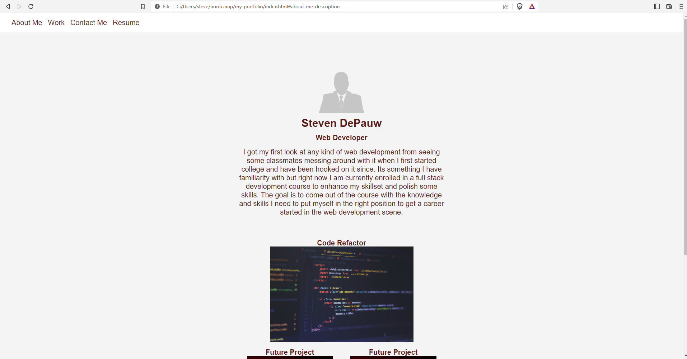
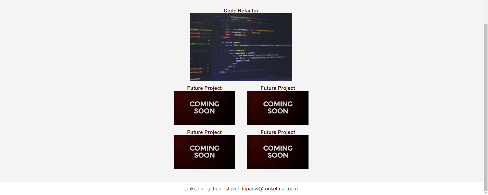
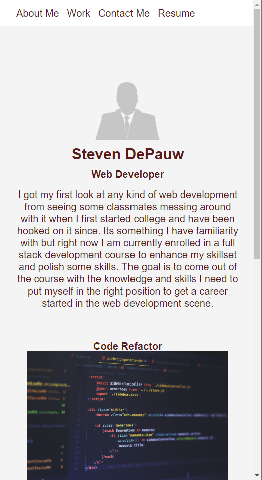
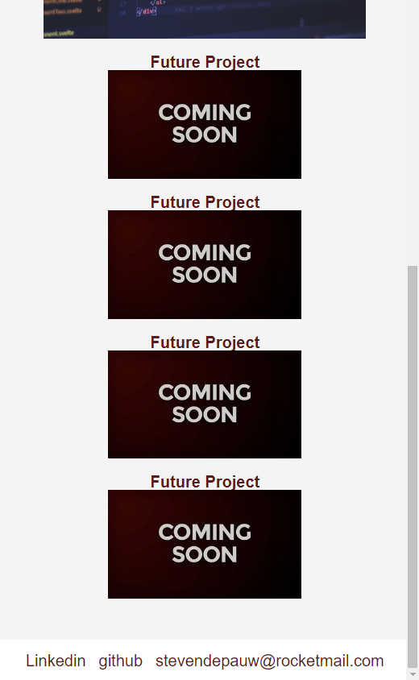

# Steven DePauw Portfolio

## Description

The purpose of this poject was to practice in making a responsive website by creating a portfolio for myself. It is a work in progress still and will continued to built upon as I get more to add to my portfoilio. This is why some of the projects pictures do not link to anything at the moment. The linkedin and resume anchors will also not go anywhere yet as I dont have a Linkedin yet or a full resume for Web Dev stuff yet.

## Mock-Up

The following images show the web application's appearance and functionality:

## Installation

N/A

## Usage
This portfoilio page can be used to view some of my works created to show off my web dev skills as well as provide information on myself or ways to get ahold of me. The links can be used to take the user to my deployed projects or directly to my resume and Linkedin.

## Credits

N/A

## License

Please refer to the LICENSE in the repo.